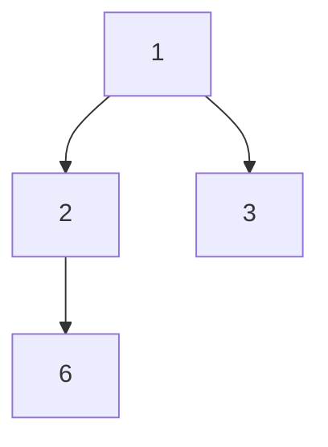
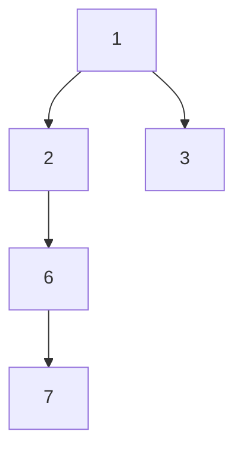
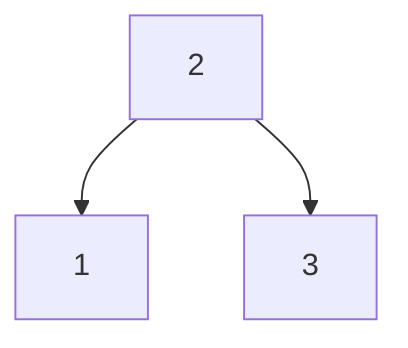
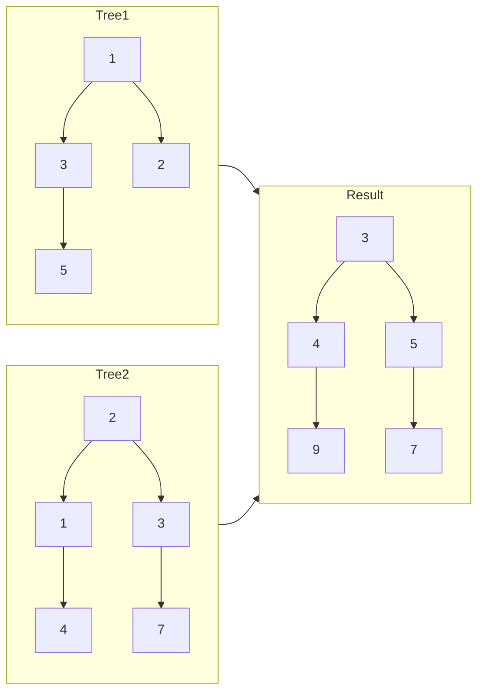
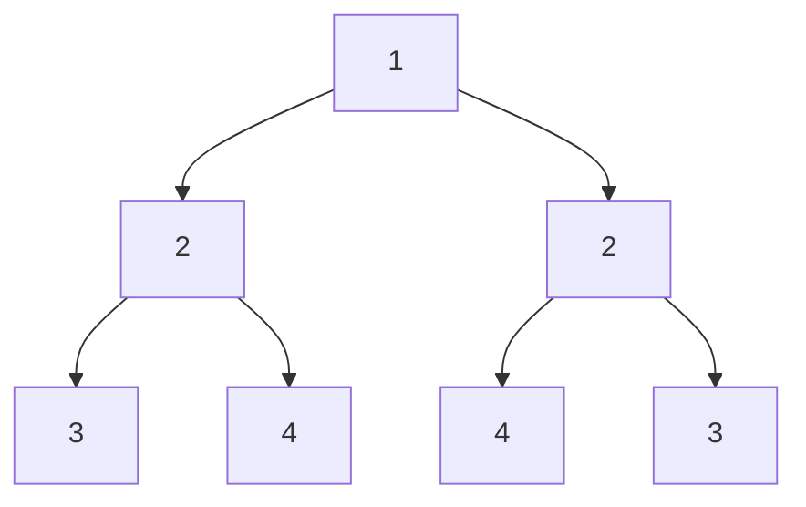
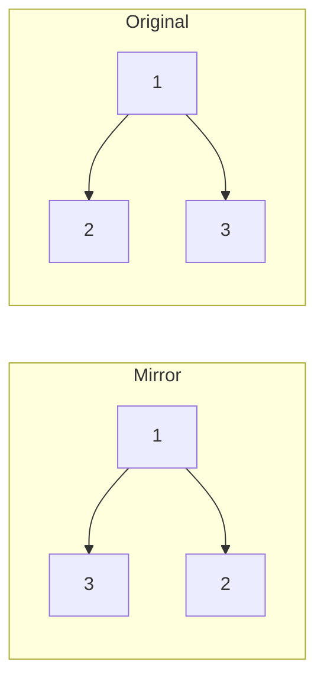
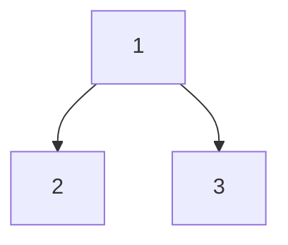
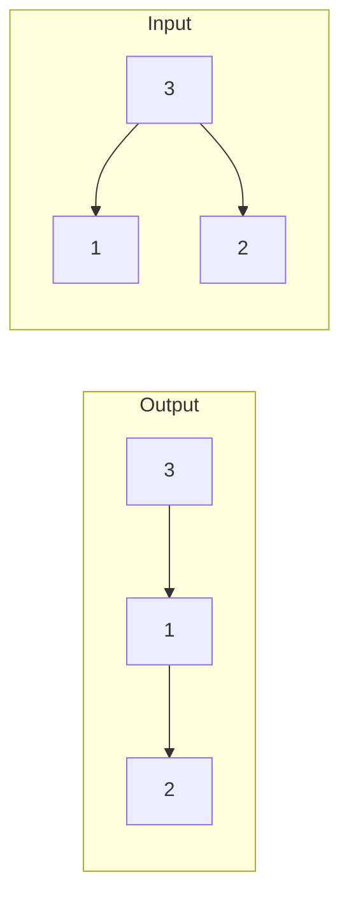
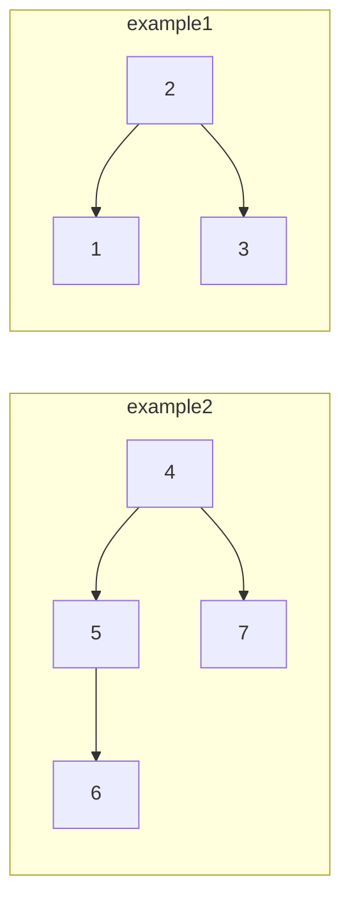

# *Tree Questions*

## *1.Node和 Tree的创建*

研究Tree的问题之前我们仍然把node和tree创建好。

```java
public class TreeNode {
    int data;
    TreeNode left;
    TreeNode right;
    public TreeNode(int data){
        this.data = data;
        this.left = null;
        this.right = null;
    }
    public TreeNode(){}
```

这里我们建立TreeNode，并提供TreeNode的两种创建，一种是有值节点，一种是null节点。


## *2.Basic Method*

谈到Tree我们首先关注它的遍历方法。Tree有四种遍历方法：前序遍历(preorder)，中序遍历(inorder)，后续遍历(postorder)，层序遍历(level order)。

在basic method这里我们先关注**除level order**之外的三个遍历方法。

这三种遍历的时间复杂度都是O(n)，空间复杂度都是O(h)。

### `preorder`

Preorder的顺序遵循：根->左->右的顺序

```java
//preorder: root-left-right
public static void preorder(TreeNode root){
    TreeNode node = root;
    if(node != null){
        System.out.print(node.data + " ");
        preorder(node.left);
        preorder(node.right);
    }
}
```

以上是用recursion的方法解决`preorder`，当然我们也可以采用 **_iteration+stack_** 的放来做(虽然本质上recursion也是使用stack):

```java
//stackPreorder: use stack to finish preorder
    //left-root-right
    public static List<Integer> stackPreorder(Node root){
        if(root == null) return new ArrayList<>();
        List<Integer> res = new ArrayList<>();
        Stack<Node> stack = new Stack<>();
        stack.push(root);
        while(!stack.isEmpty()){
            Node cur = stack.pop();
            res.add(cur.data);
            //check right and left children
            //pay attention to order of adding
            if(cur.right != null) stack.push(cur.right);
            if(cur.left != null) stack.push(cur.left);
        }
        return res;
    }
```

### `inorder`

Inorder的顺序遵循：左->根->右的顺序

```java
//inorder: left-root-right
public static void inorder(TreeNode root){
    TreeNode node = root;
    if(node != null){
        inorder(node.left);
        System.out.print(node.data + " ");
        inorder(node.right);
    }
}
```
同理的附上用 **_stack+iteration_** 解决`inorder`：
```java
//stackInorder: left-root-right
    public static List<Integer> stackInorder(Node root){
        if(root == null) return new ArrayList<>();
        List<Integer> res = new ArrayList<>();
        Stack<Node> stack = new Stack<>();
        Node cur = root;
        while(cur != null || !stack.isEmpty()){
            //iter add left children
            while(cur != null){
                stack.push(cur);
                cur = cur.left;
            }
            cur = stack.pop();
            res.add(cur.data);
            cur = cur.right;
        }
        return res;
    }
```

### `postorder`

Postorder的顺序遵循：左->右->根的顺序

```java
//postorder: left-right-root
public static void postorder(TreeNode root){
    TreeNode node = root;
    if(node != null){
        postorder(node.left);
        postorder(node.right);
        System.out.print(node.data + " ");
    }
}
```

**_iteration+stack_**:
```java
 //stackPostorder: left-right-root
    public static List<Integer> stackPostorder(Node root){
        if(root == null) return new ArrayList<>();
        List<Integer> res = new ArrayList<>();
        Stack<Node> stack = new Stack<>();
        //prev used to record if right child be accessed
        Node prev = null;
        Node cur = root;
        while(cur != null || !stack.isEmpty()){
            while(cur != null){
                stack.push(cur);
                cur = cur.left;
            }
            cur = stack.pop();
            if(cur.right == null || cur.right == prev){
                res.add(cur.data);
                //avoiding cur -> right -> cur -> right...
                prev = cur;
                cur = null;
            }else{
                //if it has right children check to right
                //push back cur
                stack.push(cur);
                cur = cur.right;
            }
        }
        return res;
    }
```
**_stack+iteration_** 的方法往往在代码的处理方面有很大的不同，而 **_recursion_** 的方法只是recursion顺序改变而已。

## *3.Simple Tree Questions*

### `maxDepth` : 找出Tree的最大深度

Example:


=>`maxDepth` return 3

思路：左右子树递归对比最终长度

```java
//maxDepth: find the maximum depth of given tree
public static int maxDepth(TreeNode root){
    if(root == null) return 0;
    int left = maxDepth(root.left);
    int right = maxDepth(root.right);
    return Math.max(left,right) + 1;
}
```

time-complexity：**O(n)**

space-complexity：**O(h)**


---
### `isBalanced`：判断Tree是否平衡
Example 1:

=>`isBalanced` return `true`

Example 2:

=> `isBalacned` => return `false`

规定左右子树深度差不超过1。

思路：与`maxDepth`一样左右递归，再作差

```java
//isBalanced: judge whether tree is balanced(maxDepth(left) - maxDepth(right) <= 1)
public static boolean isBalanced(TreeNode root){
    if(root == null) return true;
    return Math.abs(maxDepth(root.left) - maxDepth(root.right)) <= 1 && isBalanced(root.left) && isBalanced(root.right);
}
```

time-complexity：**O(nlogn)/O(n^2)**

space-complexity：**O(h)**


---
### `isBST`：判断Tree是否为binary search tree



binary search tree: 左子树<根节点<右子树

思路：如果tree为BST就一定满足inorder严格递增，先对左子树递归，只要当前节点比之前节点小，就一定不满足递增，递归完左子树之后会保存左边子树的最大值paramBST，在递归判断右边子树

```java
//isBST: judge whether tree is binary search tree(left < root <= right)
static int paramBST = Integer.MIN_VALUE;
public static boolean isBST(TreeNode root){
    if(root == null) return true;
    //make left recursion
    if(!isBST(root.left)){
        return false;
    }
    //judge current node
    if(root.data <= paramBST){
        return false;
    }
    //updates parameter
    paramBST = root.data;
    //make right recursion
    return isBST(root.right);
}
```

time-complexity：**O(n)**

space-complexity：**O(h)**


---
### `arraryToBST`: 将有序数组转化为binary search tree

思路：采用binary search的思想，每次都把mid当作新的根节点递归。

```java
//arrayToBST: transfer sorting array to binary search tree
public static TreeNode arrayToBST(int[] arr){
    if(arr.length == 0) return null;
    return auxOfArrToBST(arr,0,arr.length-1);
}
public static TreeNode auxOfArrToBST(int[] arr, int left, int right){
    //terminal
    if(left > right) return null;
    //create root
    int mid = (left+right)/2;
    TreeNode root = new TreeNode(arr[mid]);
    //create left and right by recursion
    root.left = auxOfArrToBST(arr,left,mid-1);
    root.right = auxOfArrToBST(arr,mid+1,right);
    return root;
}
```

time-complexity：**O(n)**

space-complexity：**O(h)**


---
### `mergeTree`：合并Tree，对应节点相加



思路：对应节点相加，左右递归

```java
//mergeTree: add value of node(same place but not same tree)
public static TreeNode mergeTree(TreeNode t1, TreeNode t2){
    if(t1 == null) return t2;
    if(t2 == null) return t1;
    //create root
    TreeNode root = new TreeNode(t1.data + t2.data);
    //get left and right by recursion
    root.left = mergeTree(t1.left,t2.left);
    root.right = mergeTree(t1.right,t2.right);
    return root;
}
```

time-complexity：**O(n)**

space-complexity：**O(h)**

---
### `isSymmetric`：判断Tree是否对称

Example:	



ps: null trees和两个单节点trees也算

思路：考虑三条路线相等，当前节点相等/外层相等/内层相等

```java
//isSymmetric: judge whether tree is symmetric
public static boolean isSymmetric(TreeNode root){
  	//boundary
    if(root == null) return true;
    if(root.left == null && root.right == null) return true;
    return auxIsSymmetric(root.left,root.right);
}
public static boolean auxIsSymmetric(TreeNode t1, TreeNode t2){
  	//boundary
    if(t1 == null && t2 == null) return true;
    if(t1 == null || t2 == null) return false;
  	//judge current/outer/inner
    boolean current = t1.data == t2.data;
    boolean outer = auxIsSymmetric(t1.left,t2.right);
    boolean inner = auxIsSymmetric(t1.right,t2.left);
    return current && outer && inner;
}
```

time-complexity：**O(n)**

space-complexity：**O(h)**


---
### `flipTree`：镜像反转Tree

Example:

思路：左右递归，相错连接

```java
public static TreeNode flipTree(TreeNode root){
    if(root == null) return null;
    if(root.left == null && root.right == null) return root;
    //recursion
    TreeNode left = flipTree(root.left);
    TreeNode right = flipTree(root.right);
    //connect but reverse
    root.left = right;
    root.right = left;
    return root;
}
```

time-complexity：**O(n)**

space-complexity：**O(h)**


## *4.A Little Complicated Tree Questions*

### `calcPathSum`：计算路径和



=>`calcPathSum`  return 12+13=25

思路：使用辅助函数左右递归计算左右递归和

```java
//calcPathSum: calculate path sum
public static int calcPathSum(TreeNode root){
    if(root == null) return 0;
    return auxOfcalcPS(root,0);
}
public static int auxOfcalcPS(TreeNode root, int prev){
    if(root == null) return 0;
    //updates current value
    int current = root.data + prev * 10;
    if(root.left == null && root.right == null){
        return current;
    }else{
        //recursion
        int left = auxOfcalcPS(root.left,current);
        int right = auxOfcalcPS(root.right,current);
        return left+right;
    }
}
```

time-complexity：**O(n)**

space-complexity：**O(h)**


---
### `targetEqualPS`: 计算符合要求路径和的路有多少条

Example:

target = 3

=>`targetEqualPS`  return 1 **_(必须是从root-leaf)_**

思路：在之前的基础上添加计数器记下路有多少条

```java
//targetEqualPS: find num of path that path sum equal to target(do not need to time 10 each layer)
public static int targetEqualPS(TreeNode root, int target){
    if(root == null) return 0;
    return auxTargetEqlPS(root,target,0);
}
public static int auxTargetEqlPS(TreeNode root, int target, int prev){
    if(root == null) return 0;
    //updates current value of node
    int current = root.data + prev;
    int count = 0;
    if(root.left == null && root.right == null){
        if(current == target){
            count++;
        }
    }else{
        //recursion
        count += auxTargetEqlPS(root.left,target,current);
        count += auxTargetEqlPS(root.right,target,current);
    }
    return count;
}
```

time-complexity：**O(n)**

space-complexity：**O(h)**


---
### `targetEqualPS2`:计算符合要求路径和的路有多少条，但这次计算的和不一定从根节点开始。

Example:


target = 3

=>`targetEqualPS2` return 2

思路：在之前的辅助函数的基础上，在主函数里进行计数操作(让每一个节点都当一次根节点计算)

```java
//targetEqualPS2: same with first one but don't need to start at root
public static int targetEqualPS2(TreeNode root, int target){
    if(root == null) return 0;
    //calc whole tree
    int count = auxTargetEqlPS(root,target,0);
    //calc subtree by recursion
    count += targetEqualPS2(root.left,target);
    count += targetEqualPS2(root.right,target);
    return count;
}
```

time-complexity：**O(n^2)**

space-complexity：**O(h)**


---
### `faltten`:将binary search tree按照preorder的顺序退化成linklist

Example:


思路1:preorder BST，然后装在list中

```java
public static void faltten(TreeNode root){
    if(root == null) return;
    List<TreeNode> list = new LinkedList<>();
    preorder(root,list);
    TreeNode current = list.get(0);
    for (int i = 1; i < list.size(); i++) {
        current.right = list.get(i);
        //make left empty
        current.left = null;
        //updates current node
        current = current.right;
    }
}
public static void preorder(TreeNode root, List<TreeNode> list){
    TreeNode node = root;
    if(node != null){
        list.add(node);
        preorder(node.left,list);
        preorder(node.right,list);
    }
}
```

time-complexity：**O(n)**

space-complexity：**O(n)**


思路2:直接在原来的tree上移动，先把右子树全部移动到左边子树的最右子子树，再把左子树移到原来右子树的位置

```java
public static void faltten2(TreeNode root){
    if(root == null) return;
    if(root.left == null && root.right == null) return;
    TreeNode current = root;
    while(current != null){
        //set the left of current node as a leftbreak if it has left
        if(current.left != null){
            TreeNode leftBreak = current.left;
            TreeNode rightBreak = current.left;
            //find the right break point
            while(rightBreak.right != null){
                rightBreak = rightBreak.right;
            }
            //connection
            rightBreak.right = current.right;
            current.left = null;
            current.right = leftBreak;
        }else{
            current = current.right;
        }
    }
}
```

time-complexity：**O(n)**

space-complexity：**O(1)**


---
### `kthSmallestOfBST`：找出binary search tree里第k小的节点

思路：inorder遍历找到第k个节点即为结果

```java
//find k-th smallest number in binary search tree
static int kthCount = 0;
static int kthRes = 0;
public static int kthSmallestOfBST(TreeNode root, int k){
    //inorder transverse find it
    inorder(root,k);
    return kthRes;
}
public static void inorder(TreeNode root, int k){
    if(root == null || kthCount >= k) return;
    inorder(root.left,k);
    kthCount++;
    if(kthCount == k){
        kthRes = root.data;
        return;
    }
    inorder(root.right,k);
}
```

time-complexity：**O(n)**

space-complexity：**O(h)**


---
### `commonAncestor`：找出两个nodes的最小公共parent

Example:


example1: `input` => 1,3 then `output` => 2

example2: `input` => 5,6 then `output` => 5

思路：递归找node1/node2一旦找到返回值，接下来有三种情况：1.root两边都有回传值，2.root只有一边有回传值，3.root无回传值

```java
//commonAncestor: find minimum parents of two given nodes
//recursion
public static TreeNode commonAncestor(TreeNode root, TreeNode n1, TreeNode n2){
    if(root == null) return null;
    //terminal: as long as find n1/n2 return it(it can consider as echo)
    if(root == n1 || root == n2) return root;
    //recursion
    TreeNode left = commonAncestor(root.left,n1,n2);
    TreeNode right = commonAncestor(root.right,n1,n2);
    //boundary
    if(left == null && right == null) return null;
    //three conditions: both side/only right/only left
    if(left == null) return right;
    if(right == null) return left;
    return root;
}
```

time-complexity：**O(n)**

space-complexity：**O(h)**


---
### `commonAncestorBST`：在BST里找最小公共parent

思路1：按照BST的性质我们可以optimize，只要node1/node2 < root < node1/node2，那么一定回传root，剩下两种情况和之前一样。

```java
//commonAncestorInBST: find minimum parents of two given nodes that live in binary search tree
//first method: recursion
public static TreeNode commonAncestorBSTR(TreeNode root, TreeNode n1, TreeNode n2){
    if(root == null) return null;
    //root < n1/n2
    if(root.data < n1.data && root.data < n2.data) return commonAncestorBSTR(root.right,n1,n2);
    //n1/n2 < root
    if(root.data > n1.data && root.data > n2.data) return commonAncestorBSTR(root.left,n1,n2);
    //n1/n2 < root < n1/n2 and terminal
    return root;
}
```

time-complexity：**O(n)**

space-complexity：**O(h)**


思路2:和思路1一个思路，但是采取iteration的方式找

```java
//second method: iteration
public static TreeNode commonAncestorBSTI(TreeNode root, TreeNode n1, TreeNode n2){
    if(root == null) return null;
    TreeNode current = root;
    while(current != null){
        if(current.data < n1.data && current.data < n2.data){
            //root < n1/n2
            current = current.right;
        }else if(current.data > n1.data && current.data > n2.data){
            //n1/n2 < root
            current = current.left;
        }else{
            //value of current node between n1/n2
            break;
        }
    }
    return current;
}
```

time-complexity：**O(h)**

space-complexity：**O(1)**


## *5.Queue Used In Tree Questions*

我们会在Tree questions中采取queue来完成一些algorithm

### `level_order`：层序遍历

Example:


=>`level_oreder` return [1,2,3]

思路：将节点先放入queue，然后poll出来的时候加入list，并检查该节点是否有childere，如果有就加入queue

```java
//level_order
public static List<TreeNode> level_order(TreeNode root){
    if(root == null) return null;
    List<TreeNode> res = new LinkedList<>();
    Queue<TreeNode> queue = new LinkedList<>();
    //add root
    queue.add(root);
    while(!queue.isEmpty()){
        //get current node
        TreeNode current = queue.poll();
        res.add(current);
        //push children of current nodes into queue
        if(current.left != null || current.right != null){
            queue.add(current.left);
            queue.add(current.right);
        }
    }
    return res;
}
```

time-complexity：**O(n)**

space-complexity：**O(n)**


---
### `levelOrderWithlayer`

如`level_order`的example，但是我们想return[[1],[2,3]]即按照层标注

思路：再套一层list即可，且该list每次存储一层的node

```java
//level_order: but use [] to label if nodes are in the same layer
public static List<List<TreeNode>> levelOrderWithlayer(TreeNode root){
    if(root == null) return null;
    List<List<TreeNode>> res = new LinkedList<>();
    Queue<TreeNode> queue = new LinkedList<>();
    queue.add(root);
    while(!queue.isEmpty()){
        //create layer to record nodes in the same layer
        List<TreeNode> layer = new LinkedList<>();
        //if they are in the same layer should be added into queue in advance
        int size = queue.size();
        for (int i = 0; i < size; i++) {
            //get current node
            TreeNode current = queue.poll();
            layer.add(current);
            //push children of current nodes into queue
            if(current.left != null || current.right != null){
                queue.add(current.left);
                queue.add(current.right);
            }
        }
        //put layer into res
        res.add(layer);
    }
    return res;
}
```

time-complexity：：**O(n)**

space-complexity：**O(n)**


---
### `serialize`：序列化

即将tree按照level-order的顺序变成String

思路1: 按照我们之前的`level_order`的做法，采取BFS

```java
//serialize: still level order but out put strings instead of list of treenodes
public static String serializeBFS(TreeNode root){
    if(root == null) return "";
    StringBuilder sb = new StringBuilder();
    Queue<TreeNode> queue = new LinkedList<>();
    queue.add(root);
    while(!queue.isEmpty()){
        //get current node
        TreeNode current = queue.poll();
        //check if current node is null
        if(current == null){
            sb.append("null");
        }else{
            sb.append("" + current.data);
            //add chlidren
            queue.add(current.left);
            queue.add(current.right);
        }
        sb.append(",");
    }
    return sb.substring(0,sb.length()-1);
}
```

time-complexity：**O(n)**

space-complexity：**O(n)**


思路2:采取recursion的DFS方法，但是该方法倾向于preorder顺序而不是levelorder

```java
//if use DFS, it more tends to be preorder
public static String serializeDFS(TreeNode root){
    if(root == null) return "null";
    return root.data + "," + serializeDFS(root.left) + "," + serializeDFS(root.right);
}
```

time-complexity：**O(n^2)**

space-complexity：**O(h)**


---
### `deserialize`：反序列化

即将String变成Tree，按照`level order`的顺序

思路：先把String变成array，然后再一个个连接

```java
//deserialize: change string to treenode
public static TreeNode deserialize(String str){
    if(str == "") return null;
    Queue<TreeNode> queue = new LinkedList<>();
    //split string
    String[] strArr = str.split(",");
    //create root
    TreeNode root = new TreeNode(Integer.parseInt(strArr[0]));
    queue.add(root);
    //create index of strArr
    int index = 1;
    while(!queue.isEmpty()){
        //get current node
        TreeNode current = queue.poll();
        //connect left
        if(!strArr[index].equals("null")){
            current.left = new TreeNode(Integer.parseInt(strArr[index]));
            queue.add(current.left);
        }
        //updates index
        index++;
        //connect right
        if(!strArr[index].equals("null")){
            current.right = new TreeNode(Integer.parseInt(strArr[index]));
            queue.add(current.right);
        }
        //updates index
        index++;
    }
    return root;
}
```

time-complexity：**O(n)**

space-complexity：**O(n)**